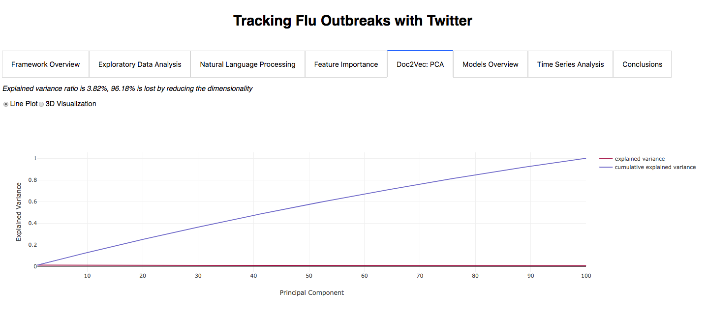

# Tracking Flu Outbreaks with Twitter

## Project Motivation

## Process Overview

## Data Sources 

### Twitter

### CDC

## Visualizations
All visualizations were presented on a Flask app, using Dash as an interactive interface. 

## Natural Language Processing: Feature Extraction
In order to be used in machine learning algorithms, text must be converted into vectors of numbers. Such vectors are intended to represent characteristics of the texts. Two models were used: the Bag-of-Words model and vector embedding. 

### Bag-of-Words (BoW)
A BoW is a simplistic representation of a document; the occurrence of each word is measured and used as a feature. It is called a *bag* of words because the arrangement of the words, or any other details, are not considered. Documents are simply characterized by the presence of known words.

n-gram features: The size of word pairings were also assessed: unigram (only single words are counted), bigram (1 to 2 words are counted), trigram (1 to 3 words are counted). That is, you can also work with pairs and triplets of words, rather than just single words. For example, 'new york' is more informative than 'new' and 'york', separately. 

**Count Vectorization**

The (count) frequency of each known word in a given document is measured. 

**TF-IDF Vectorization**

The frequency of each known word is offset by its overall frequency in the corpus (the collection of documents). 

### Word Embedding: Doc2Vec
In contrast with the BoW model, word embedding also considers the *context* of words. Doc2Vec is an unsupervised algorithm that generates vector representations of documents, regardless of length, in order to assess the similarity between documents. Each document is mapped to a unique vector and each word is mapped to a unique vector. 

It should be noted that there are a few caveats to using Doc2Vec for this particular dataset: 

(1) Because the corpus is composed of tweets, with many misspellings, Doc2Vec is not necessarily ideal because it's much more difficult to assess the similarity between tweets as there are so many variations in spelling and phrases. 

(2) The training set was fairly limited in size and not diverse enough for a Doc2Vec model to learn true contextual relations and generate reasonably embeddings accordingly. 

However, I wanted to compare word embedding to the BoW model in order to see how it handled my data. 

**Principal Component Analysis**

In conjunction with Doc2Vec, I also conducted principal component analysis for potential dimensionality reduction. If there are certain features that are more 'important' for characterizing flu/non-flu related tweets and others that are considerably less important, then it makes more sense to only use the more important features. The less important features don't contribute much and only add to the time and computational resources needed for subsequent classification. 

The fairly linear trend of the cumulative explained variance (in purple) indicates that each of the principal components roughly equally contributes to the explained variance -- dimensionality reduction would not be helpful. The explained variance (in maroon) remains flat as well. 

This is also evident with a 3D plot, where the data was arbitrarily reduced to 3 dimensions. 

There are no distinct clusters between related and unrelated tweets in 3 dimensions so reduction to, say, 3 dimensions would not be helpful. Indeed, 96.18% of explained variance is lost by reducing to 3 dimensions. 

### NLP Model Selection
After experimentation with the BoW model and word embedding, I chose to use trigram TF-IDF vectorization because it worked the best with my data. 

### Feature Importance
I used the chi-square statistic to measure the relationship between a given feature (word in a tweet) and the tweet class (related or unrelated to flu infection). 

I plotted the top 10 features, with the highest chi-square values, to determine which features were the *most* predictive of a tweet's class. 

## Machine Learning: Tweet Identification
The following machine learning classification algorithms were used:
* Multinomial Naive Bayes 
* Logistic Regression
* Random Forest
* Gradboost
* Adaboost
* Support Vector Machine

For cross-validation,the annotated tweet dataset was split into training and validation sets.

For each classifier, a grid-search was run to determine the best hyperparameters for the given classifier. Classifiers were then fit on the training data and assessed using the following metrics:

* Validation accuracy
* Confusion matrices
* ROC curves

### Cross-Validation: Validation Accuracy
A given classification model was fit on the training data. It then classified the validation data. To assess the accuracy of the model, those predictions were compared to the actual labels. 

### Confusion Matrices
For a given classifier, a confusion matrix could be constructed. The confusion matrix is used to show the number of:

* True positives: Related tweets that the classifier labeled as related
* True negatives: Unrelated tweets that the classifier labeled as unrelated
* False positives: Unrelated tweets that the classifier labeled as related
* False negatives: Related tweets that the classifier labeled as unrelated

### ROC Curves

### Machine Learning Model Selection 

## Time-Series Analyses

## Conclusions 
